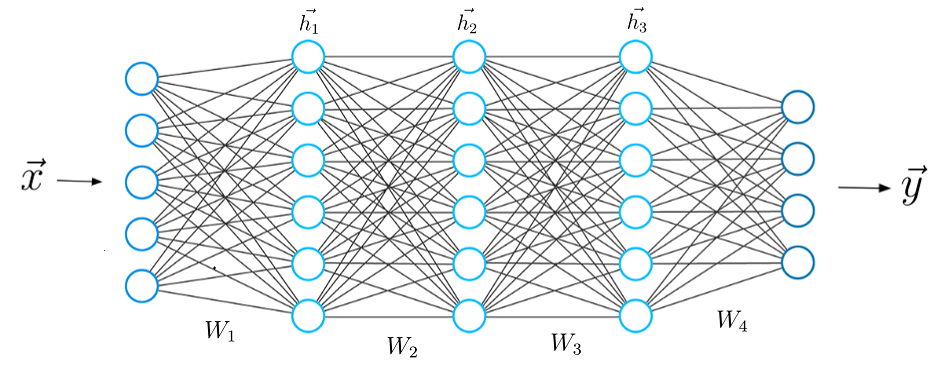

# CNN-based-Image-Classfier-using-Keras
Building CNN based Image Classfier using Keras and deploying it to Comet.

## What is Deep Learning?
A branch of machine learning is deep learning. Deep learning systems can perform better with access to more data, which is the machine equivalent of more experience, in contrast to typical machine learning algorithms, many of which have a finite ability to learn regardless of the amount of data they obtain. Machines may be trained to perform specific activities such as driving a car, spotting weeds in a field of crops, diagnosing illnesses, checking machinery for flaws, and other jobs once they have acquired sufficient experience through deep learning.

## Keras
Keras, an open-source, deep-learning library, was developed by Francois Chollet, a deep-learning researcher at Google. With Keras, users may rapidly translate code into a product because of its user-friendly design principles. This indicates that it was created following a set of criteria that aims to make it effective, dependable, and available to a broad audience. It has several uses in both business and academics as a result. It also offers comprehensive developer instructions.

## CNN
Convolutional neural networks (CNNs) are a subtype of artificial neural networks that have been popular in several applications linked to computer vision and are attracting interest in other domains.

## Tools 🛠 
- Pandas  `pip install pandas`
- Numpy  `pip install numpy`
- TensorFlow  `pip install tensorflow`
- Keras_tuner  `pip install kera_turner`
- Comet  `pip install comet-ml`

## Links 🌍 
- [Comet](www.comet.ml)
- [Tensorflow](www.dacade.org)

## Article
